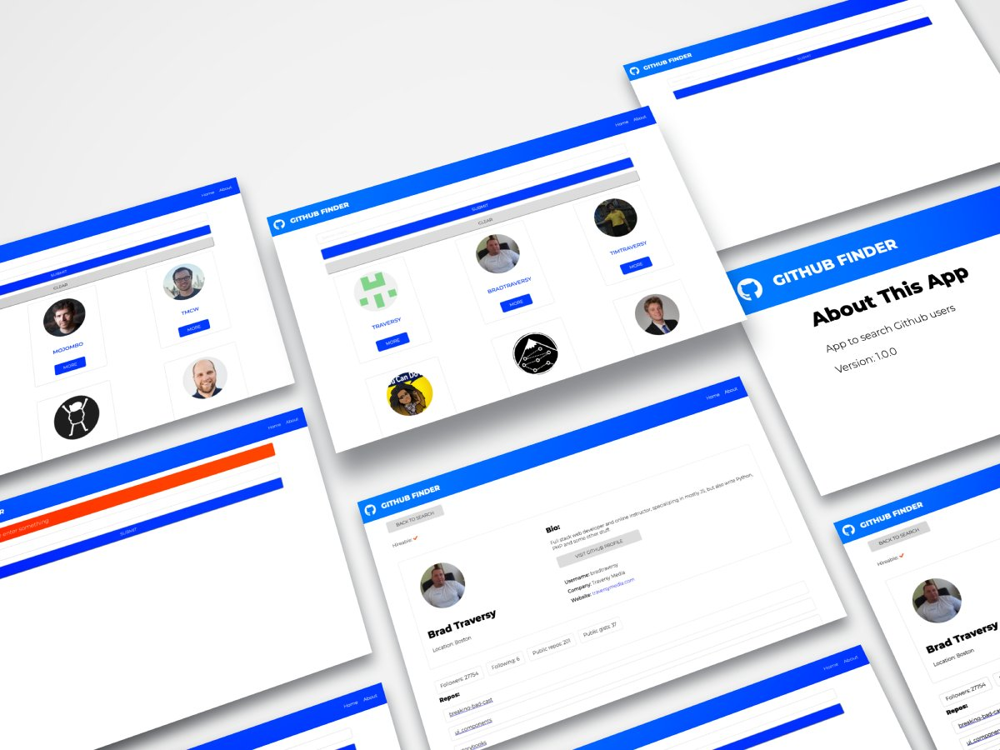

# GitHub Finder

> React application to search for Github user profiles, and view their latest repositories and other information.

## Table of contents

- [General info](#general-info)
- [Screenshots](#screenshots)
- [Technologies](#technologies)
- [Setup](#setup)
- [Features](#features)
- [Inspiration](#inspiration)

## General info

React application to search for Github user profiles, and view their latest repositories and other information.

This app uses the Context API along with the useContext and useReducer hooks for state management and is part of the "Modern React Front To Back" Udemy course.

This project was bootstrapped with Create React App.

## Live demo

[https://search-github-profiles.netlify.app/](https://search-github-profiles.netlify.app/)

## Screenshots

## Technologies

- React, based on:
  - Hooks,
  - Context API along with the useContext and useReducer hooks for state management
- React-router
- Axios
- Styled-components
- react-fontawesome

## Setup

In the project directory, you can run:

### `npm start`

Runs the app in the development mode. 
Open [http://localhost:3000](http://localhost:3000) to view it in the browser.

The page will reload if you make edits. 
You will also see any lint errors in the console.

### `npm run build`

Builds the app for production to the `build` folder. 
It correctly bundles React in production mode and optimizes the build for the best performance.

## Features

- searching for profiles on github
- select a specific profile, and view details:
  - basic account information
  - number of: public repositories, public gist, followers and followings
  - displays the last five repositories

## Inspiration

based on the "Modern React Front To Back" Udemy course by Brad Traversy.
